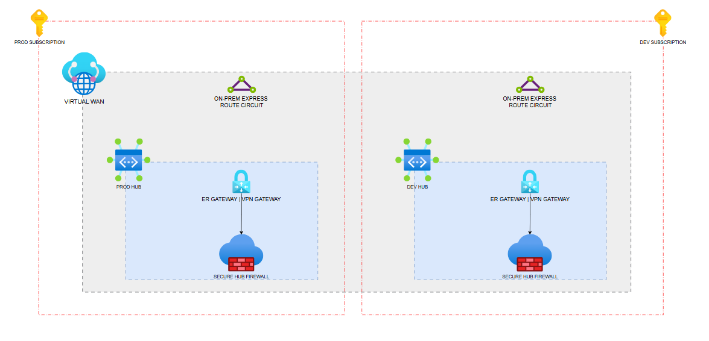

> [!IMPORTANT]
> This repository uses **Azure Verified Modules (AVM)** and is intended as a reference implementation.
> Any input values, defaults, and examples provided here are **samples only**.
> Review and adapt the configuration to meet your organization’s requirements (security, networking, naming, regions, compliance, etc.) before using it.

> [!NOTE]
> AVM modules may introduce changes over time (including breaking changes). For AVM bugs or feature requests, please raise issues with the relevant AVM module repository.

# demo-eslz-connectivity-shared

Terraform configuration to deploy a Virtual WAN based connectivity foundation using AVM modules.

## What this deploys

Per environment (dev/prod) this repo can deploy:

- Resource groups (optional; managed via `resource_groups`)
- Firewall policies + rule collection groups (tfvars-driven)
- Virtual hubs (vHubs)
- Optional secured hubs (Azure Firewall `AZFW_Hub` attached to a vHub)
- Optional Private DNS Resolver (per vHub, deployed into a sidecar VNet)
- Optional ExpressRoute gateways (in each vHub)
- Optional ExpressRoute circuits (one or many; provider-based or ExpressRoute Direct)

Virtual WAN (vWAN) is intended to be created **once** (typically in prod) and referenced from other environments.

## Repo layout

- `modules/`
	- `modules/vwan`: AVM Virtual WAN wrapper
	- `modules/vhub`: AVM Virtual Hub wrapper + optional Azure Firewall
	- `modules/fwpolicy`: Azure Firewall Policy + rule collection groups
	- `modules/private_dns_resolver`: Private DNS Resolver + sidecar VNet + optional vHub connection
	- `modules/expressroute_gateway`: AVM ExpressRoute Gateway (vWAN/vHub) wrapper
	- `modules/expressroute_circuit`: AVM ExpressRoute Circuit wrapper
- `environments/`
	- `environments/dev/backend.hcl` + `environments/dev/terraform.tfvars`
	- `environments/prod/backend.hcl` + `environments/prod/terraform.tfvars`

## Architecture diagram

The architecture diagram is shown below:

## Template placeholders (required)

This repository is intentionally sanitized and contains placeholder values (for example, `ADD_YOUR_SUBSCRIPTION_ID`) for environment-specific identifiers.

Before `terraform init/plan/apply` (locally or in GitHub Actions), you must:

- Update `environments/dev/backend.hcl` and `environments/prod/backend.hcl` to point at your remote state storage.
- Set real subscription/tenant IDs in `environments/*/terraform.tfvars` (or override via `TF_VAR_*` environment variables).
- Configure GitHub Actions repo variables used for Azure OIDC login (`ARM_CLIENT_ID`, `ARM_TENANT_ID`, `ARM_SUBSCRIPTION_ID`).

## Prerequisites

- Terraform `>= 1.9, < 2.0`
- Azure permissions for the identity you use (Azure CLI locally, or GitHub OIDC in CI)
- Existing remote state storage (Storage Account + Container) referenced by each `backend.hcl`

### Azure permissions (minimum guidance)

The executing identity typically needs, at minimum:

- On the hub subscription(s): permissions to create/read RGs, vHubs, firewalls, firewall policies, and optionally ExpressRoute resources.
- On the vWAN subscription (if different): permissions to create/read vWAN (prod) and/or read vWAN (dev).
- On the state subscription: permissions to read/write blob state (Storage Account).

If you see `403` errors like `Microsoft.Resources/subscriptions/providers/read`, assign at least `Reader` at subscription scope plus appropriate contributor rights for the resources you manage.

## Configuration model

This repo uses a single root module with environment-specific tfvars.

Key inputs:

- `resource_groups` / `existing_resource_groups`
- `virtual_wan` (managed) **or** `existing_virtual_wan` (lookup) — exactly one must be set
- `virtual_hubs` map (each hub can include optional `firewall`, optional `private_dns_resolver`, and optional `expressroute_gateway`)
- `firewall_policies` map
- `expressroute_circuits` map (optional)

### Multi-subscription support

If your hub resources and vWAN live in different subscriptions, set:

- `hub_subscription_id` / `hub_tenant_id`
- `virtual_wan_subscription_id` / `virtual_wan_tenant_id` (optional; defaults to hub values)

Tip: you can override tfvars without committing IDs by using environment variables, e.g. `TF_VAR_hub_subscription_id`.

## How to run locally

From the repo root:

- Prod:
	- `terraform init -backend-config=environments/prod/backend.hcl`
	- `terraform plan -var-file=environments/prod/terraform.tfvars`
	- `terraform apply -var-file=environments/prod/terraform.tfvars`

- Dev:
	- `terraform init -backend-config=environments/dev/backend.hcl`
	- `terraform plan -var-file=environments/dev/terraform.tfvars`
	- `terraform apply -var-file=environments/dev/terraform.tfvars`

### Recommended apply order

If dev references an existing vWAN (via `existing_virtual_wan`), run **prod first** so the vWAN exists, then run dev.

## How to run via GitHub Actions

Workflow: `.github/workflows/terraform.yml`

- `pull_request` to `main` runs **plan** for `dev` and `prod`.
- `push` to `main` runs **plan + apply**.
- `workflow_dispatch` supports `plan` or `apply`.

The workflow uses `azure/login@v2` OIDC and expects repo variables (or defaults):

- `ARM_CLIENT_ID`
- `ARM_TENANT_ID`
- `ARM_SUBSCRIPTION_ID` (used only for Azure login context; Terraform uses subscription IDs from tfvars)

Make sure the GitHub OIDC app registration has federated credentials for this repo/branch.

## ExpressRoute notes

### ExpressRoute gateway (Virtual WAN)

The vWAN ExpressRoute Gateway is created **inside the vHub** (no VNet required). Configure it per hub under:

### ExpressRoute circuits

ExpressRoute circuits are created via `expressroute_circuits` (map), allowing multiple circuits per environment.

Important operational note:

1. Create the circuit first (no peerings / no connections)
2. Share the **service key** with your provider and wait until the circuit shows **Provisioned**
3. Then add `peerings` and/or `er_gw_connections`

If you try to configure peerings before the circuit is provisioned, applies can fail.

## Outputs

Useful root outputs include:

- `virtual_wan_id`
- `virtual_hub_ids`
- `virtual_hub_firewall_ids`
- `private_dns_resolver_ids`
- `private_dns_resolver_inbound_endpoint_ips`
- `private_dns_resolver_sidecar_vnet_ids`
- `expressroute_gateway_ids`
- `expressroute_circuit_ids`
