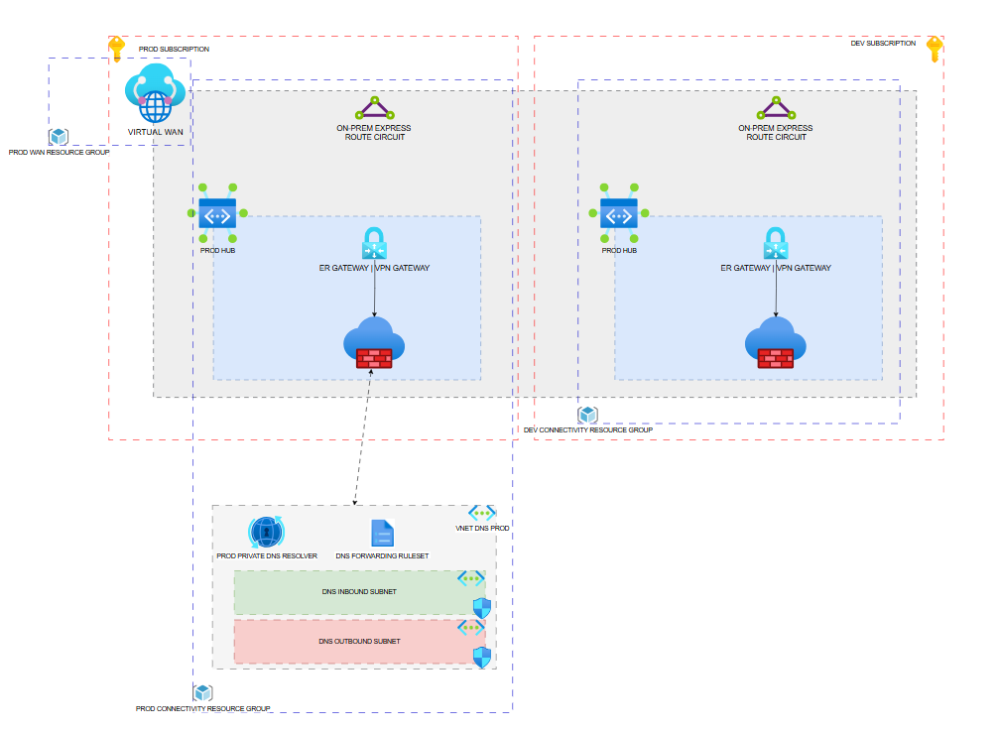

> [!IMPORTANT]
> This repository uses **Azure Verified Modules (AVM)** and is intended as a reference implementation.
> Any input values, defaults, and examples provided here are **samples only**.
> Review and adapt the configuration to meet your organization’s requirements (security, networking, naming, regions, compliance, etc.) before using it.

> [!NOTE]
> AVM modules may introduce changes over time (including breaking changes). For AVM bugs or feature requests, please raise issues with the relevant AVM module repository.

# msft-eslz-connectivity

Terraform configuration to deploy a Virtual WAN based connectivity foundation using AVM modules.

## What this deploys

This repo can deploy:

- Resource groups (optional; managed via `resource_groups`)
- Firewall policies + rule collection groups (tfvars-driven)
- Virtual hubs (vHubs)
- Optional secured hubs (Azure Firewall `AZFW_Hub` attached to a vHub)
- Optional Private DNS Resolver (Azure DNS Private Resolver) hosted in a per-hub sidecar VNet
- Optional ExpressRoute gateways (in each vHub)
- Optional ExpressRoute circuits (one or many; provider-based or ExpressRoute Direct)
- Optional Site-to-Site VPN (S2S VPN Gateway, VPN Sites, and Connections) per hub

## Repo layout

- `modules/`
	- `modules/fwpolicy`: Azure Firewall Policy + rule collection groups
	- `modules/expressroute_circuit`: AVM ExpressRoute Circuit wrapper
- `environments/`
	- `environments/prod/backend.hcl` + `environments/prod/terraform.tfvars`

## Architecture diagram

The architecture diagram is shown below:



## Prerequisites

- Terraform `>= 1.9, < 2.0`
- Azure permissions for the identity you use (Azure CLI locally, or GitHub OIDC in CI)
- Existing remote state storage (Storage Account + Container) referenced by each `backend.hcl`

### Azure permissions (minimum guidance)

The executing identity typically needs, at minimum:

- On the hub subscription(s): permissions to create/read RGs, vHubs, firewalls, firewall policies, and optionally ExpressRoute resources.
- On the vWAN subscription (if different): permissions to create/read vWAN.
- On the state subscription: permissions to read/write blob state (Storage Account).

If you see `403` errors like `Microsoft.Resources/subscriptions/providers/read`, assign at least `Reader` at subscription scope plus appropriate contributor rights for the resources you manage.

### GitHub Actions (OIDC) permissions model

This repo’s CI is designed to authenticate to Azure **without secrets** using GitHub Actions OIDC (`azure/login@v2`).

There are two distinct “permission planes” you must satisfy:

- **Azure control-plane RBAC** (ARM): create/update/read Azure resources (vWAN/vHub/Firewall/etc).
- **Storage data-plane RBAC** (Blob): read/write Terraform remote state in the storage account container referenced by `environments/prod/backend.hcl`.

#### Minimum Azure RBAC roles (typical)

Pick the narrowest scopes you can. Common starting point:

- On the **hub subscription(s)** (or the specific RGs): `Contributor`
- On the **vWAN subscription** (or vWAN RG): `Contributor`
- On the **state storage account scope** (or RG): `Storage Blob Data Contributor`

Notes:

- `Contributor` does **not** grant data-plane access to blobs; you must explicitly grant `Storage Blob Data Contributor`.
- If your Terraform config creates role assignments, the identity also needs `User Access Administrator` or `Owner` at the target scopes.

#### Permissions needed to create the OIDC integration

The person running the setup commands needs:

- Microsoft Entra permissions to create an app registration / service principal (e.g., Application Administrator).
- Azure permissions to assign roles at the target scopes (e.g., `Owner` or `User Access Administrator`).

## Configuration model

This repo uses a single root module with environment-specific tfvars.

Key inputs:

- `resource_groups` / `existing_resource_groups`
- `virtual_wan` (managed)
- `virtual_hubs` map (each hub can include optional `firewall`, optional `expressroute_gateway`, optional `private_dns_resolver`, and optional `site_to_site_vpn`)
- `firewall_policies` map
- `expressroute_circuits` map (optional)

### Multi-subscription support

If your hub resources and vWAN live in different subscriptions, set:

- `hub_subscription_id` / `hub_tenant_id`
- `virtual_wan_subscription_id` / `virtual_wan_tenant_id` (optional; defaults to hub values)

Tip: you can override tfvars without committing IDs by using environment variables, e.g. `TF_VAR_hub_subscription_id`.

## How to run locally

From the repo root:

- Prod:
	- `terraform init -backend-config=environments/prod/backend.hcl`
	- `terraform plan -var-file=environments/prod/terraform.tfvars`
	- `terraform apply -var-file=environments/prod/terraform.tfvars`

## How to run via GitHub Actions

Workflow: `.github/workflows/terraform.yml`

- `push` to `main` runs **plan + apply**.
- `pull_request` to `main` runs **plan** for `prod`.
- `workflow_dispatch` supports `plan` or `apply` for `prod`.

The workflow uses `azure/login@v2` OIDC and expects repo variables (or defaults):

- `ARM_CLIENT_ID`
- `ARM_TENANT_ID`
- `ARM_SUBSCRIPTION_ID` (used only for Azure login context; Terraform uses subscription IDs from tfvars)

Make sure the GitHub OIDC app registration has federated credentials for this repo/branch.

### One-time setup: Create GitHub OIDC auth for this repo (Azure CLI)

This section is the “copy/paste” setup to let a customer run a small set of commands to enable the workflows.

#### 0) Decide your values

Set these in your shell (examples shown):

```bash
# Azure
AZ_TENANT_ID="00000000-0000-0000-0000-000000000000"
AZ_SUBSCRIPTION_ID="00000000-0000-0000-0000-000000000000"  # login context

# GitHub
GH_ORG="cx-demo-org"
GH_REPO="msft-eslz-connectivity"
GH_BRANCH="main"

# Naming
APP_NAME="${GH_REPO}-gha-oidc"
```

Login and select the subscription you want as the **login context** for CI:

```bash
az login --tenant "$AZ_TENANT_ID"
az account set --subscription "$AZ_SUBSCRIPTION_ID"
```

#### 1) Create an Entra app registration + service principal

```bash
APP_ID="$(az ad app create --display-name "$APP_NAME" --query appId -o tsv)"
APP_OBJECT_ID="$(az ad app show --id "$APP_ID" --query id -o tsv)"
az ad sp create --id "$APP_ID" >/dev/null
SP_OBJECT_ID="$(az ad sp show --id "$APP_ID" --query id -o tsv)"
echo "APP_ID=$APP_ID"
echo "APP_OBJECT_ID=$APP_OBJECT_ID"
echo "SP_OBJECT_ID=$SP_OBJECT_ID"
```

#### 2) Add federated credentials for GitHub Actions

GitHub uses different `sub` (subject) claims depending on event type.

This workflow runs on:

- `push` to `main`
- `pull_request` targeting `main`
- `workflow_dispatch` (manual)

Create **both** federated credentials below:

```bash
cat > federated-cred-push.json <<'JSON'
{
	"name": "github-push-main",
	"issuer": "https://token.actions.githubusercontent.com",
	"subject": "repo:GH_ORG/GH_REPO:ref:refs/heads/GH_BRANCH",
	"description": "GitHub Actions OIDC - push/manual runs on branch",
	"audiences": ["api://AzureADTokenExchange"]
}
JSON

sed -i "s/GH_ORG/$GH_ORG/g; s/GH_REPO/$GH_REPO/g; s/GH_BRANCH/$GH_BRANCH/g" federated-cred-push.json
# macOS note: if you see an error from sed, try: sed -i '' "..." federated-cred-push.json

az ad app federated-credential create \
	--id "$APP_OBJECT_ID" \
	--parameters @federated-cred-push.json

cat > federated-cred-pr.json <<'JSON'
{
	"name": "github-pull-request",
	"issuer": "https://token.actions.githubusercontent.com",
	"subject": "repo:GH_ORG/GH_REPO:pull_request",
	"description": "GitHub Actions OIDC - pull_request runs",
	"audiences": ["api://AzureADTokenExchange"]
}
JSON

sed -i "s/GH_ORG/$GH_ORG/g; s/GH_REPO/$GH_REPO/g" federated-cred-pr.json

az ad app federated-credential create \
	--id "$APP_OBJECT_ID" \
	--parameters @federated-cred-pr.json
```

If you later change the workflow to run from another branch, you must add another federated credential with the matching `ref:refs/heads/<branch>` subject.

#### 3) Assign Azure RBAC roles to the service principal

Grant at the narrowest scope possible. Examples:

```bash
# Example: allow Terraform to deploy connectivity resources in a specific resource group
HUB_RG_ID="/subscriptions/00000000-0000-0000-0000-000000000000/resourceGroups/rg-connectivity"
az role assignment create \
	--assignee-object-id "$SP_OBJECT_ID" \
	--assignee-principal-type ServicePrincipal \
	--role "Contributor" \
	--scope "$HUB_RG_ID"

# Example: allow Terraform state access (data plane) on the storage account
STATE_SA_ID="/subscriptions/00000000-0000-0000-0000-000000000000/resourceGroups/rg-tfstate/providers/Microsoft.Storage/storageAccounts/sttfstate123"
az role assignment create \
	--assignee-object-id "$SP_OBJECT_ID" \
	--assignee-principal-type ServicePrincipal \
	--role "Storage Blob Data Contributor" \
	--scope "$STATE_SA_ID"
```

If your configuration deploys across multiple subscriptions (hub vs vWAN vs state), repeat role assignments at each required scope.

### Final step: Set GitHub repo variables used by the workflow

The workflow reads these values as GitHub **Repo Variables**:

- `ARM_CLIENT_ID` = `$APP_ID`
- `ARM_TENANT_ID` = your tenant id
- `ARM_SUBSCRIPTION_ID` = subscription used for Azure login context

You can set them in the GitHub UI (Settings → Secrets and variables → Actions → Variables).

Optionally, if you have GitHub CLI installed, you can set them from your terminal:

```bash
gh repo set-default "$GH_ORG/$GH_REPO"
gh variable set ARM_CLIENT_ID --body "$APP_ID"
gh variable set ARM_TENANT_ID --body "$AZ_TENANT_ID"
gh variable set ARM_SUBSCRIPTION_ID --body "$AZ_SUBSCRIPTION_ID"
```

## ExpressRoute notes

### ExpressRoute gateway (Virtual WAN)

The vWAN ExpressRoute Gateway is created **inside the vHub** (no VNet required). Configure it per hub under:


### ExpressRoute circuits

ExpressRoute circuits are created via `expressroute_circuits` (map), allowing multiple circuits per environment.

Important operational note:

1. Create the circuit first (no peerings / no connections)
2. Share the **service key** with your provider and wait until the circuit shows **Provisioned**
3. Then add `peerings` and/or `er_gw_connections`

If you try to configure peerings before the circuit is provisioned, applies can fail.

## Outputs

Useful root outputs include:

- `virtual_wan_id`
- `virtual_hub_ids`
- `virtual_hub_firewall_ids`
- `expressroute_gateway_ids`
- `expressroute_circuit_ids`
